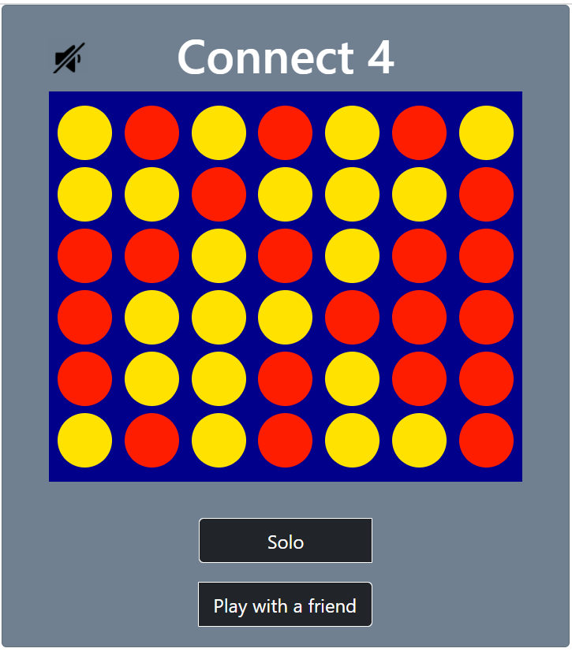

# Project - Connect 4

A Connect 4 game created with node.js and Express framework.



## Table of contents
* [Getting started](#getting-started)
* [How to Play](#how-to-play)
* [Version history](#version-history)
* [Contributing](#contributing)

	
## Getting started
To run this game, clone this repo by running

```
$ git clone https://github.com/School-Of-Tech-Futures-UK/git-demo-yingyingchen.git
``` 

at the terminal. Within the `git-demo-yingyingchen` folder, install required dependencies using npm:

```
$ cd ../Connect4
$ npm install
$ cd server
$ npm install
```

At the terminal, run

```
$ cd server
$ node index
```

Open http://localhost:3001/connect4 and start playing!


## How to play

* Enter the name of each player. Player red will go first
* At each turn, a player will click on a column and a disc with the player's color will drop to this column
* If one of the players is able to place four discs of the same color in a line, the player is declared as the winner
* Try winning with as little moves as you can

## Version history

* 1.1

    * Added api server to track scores
    * Added a score board to display the top ten high scores
* [1.0](http://github.com/School-Of-Tech-Futures-UK/git-demo-yingyingchen/tree/368a5626464dbae863679d9828eb5b24c0ffd5d3)

    * Initial Release

## Contributing
If you have an idea that would make this project better, feel free to fork this repo and create a pull request.
* Fork the project
* Create your own feature branch 
```
$ git checkout -b feature/yourFeatureName
```
* Commit your changes 
```
$ git commit -m 'Added yourFeatureName'
```
* Push your branch
```
$ git push origin feature/yourFeatureName
```
* Open a pull request


You can also create an issue with the label `enhancement` to suggest any cool new features. Any contributions you make are greatly appreciated. Hope you enjoy the game! Many thanks 😇
